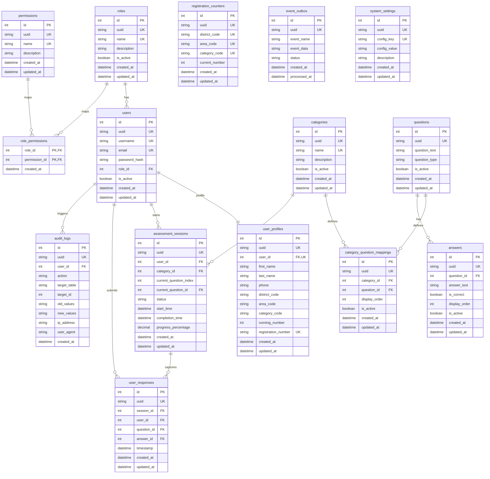

# Entity Relationship Diagram (ERD) — Smission Core Engine

Below is the database schema relation diagram using Mermaid syntax, illustrating the primary and foreign keys, relationships, and metadata columns.

