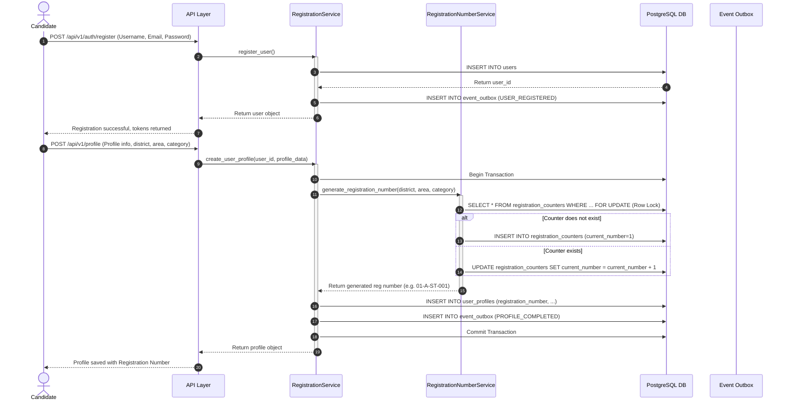
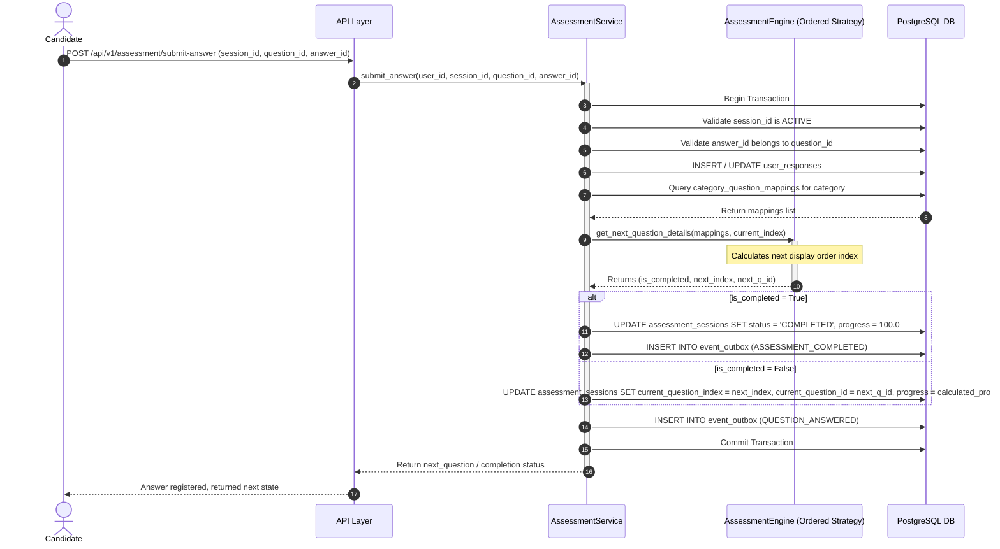

# Sequence Diagrams — Smission Core Engine

This document contains sequence diagrams for critical operations in the Core Engine using Mermaid.

## 1. Candidate Transactional Registration & Registration Number Generation

This diagram illustrates how Phase 4 (Registration Engine) and Phase 5 (Registration Number Service) operate transactionally.

---

## 2. Assessment Session Flow & Answer Submission

This diagram details the navigation and strategy execution for question delivery.

