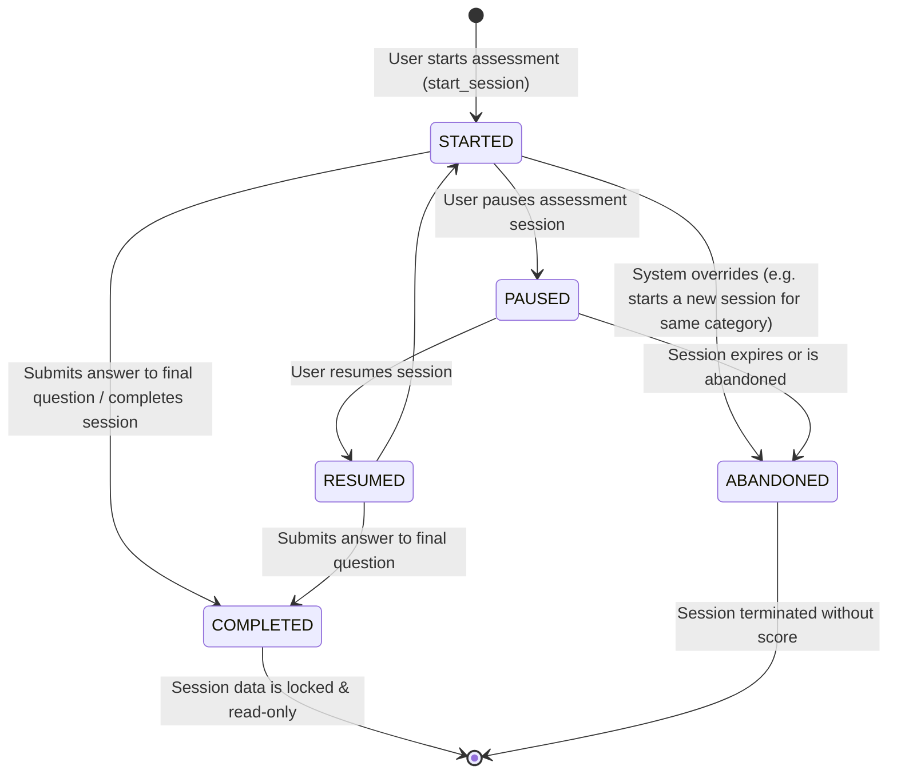
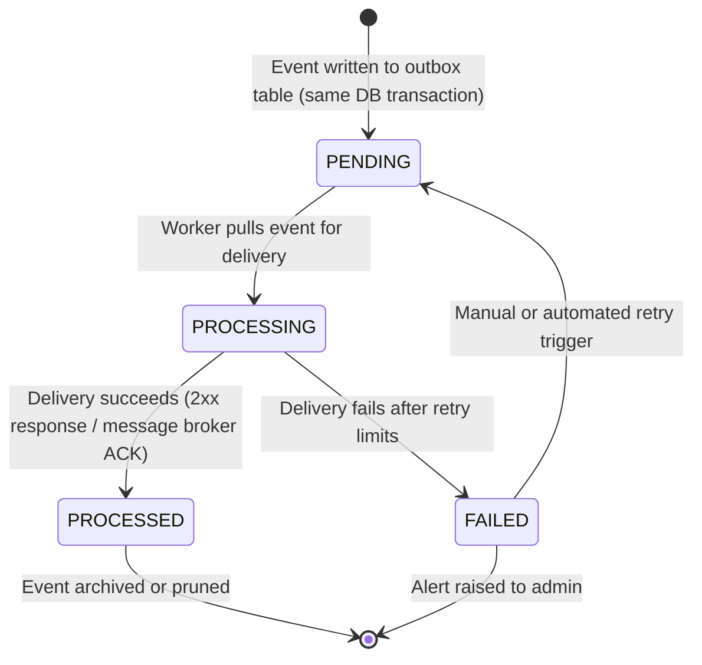

# State Machines — Smission Core Engine

This document details the state lifecycles for critical components of the Smission platform.

## 1. Assessment Session State Machine
A candidate's assessment session follows a strict, non-reversible lifecycle once completed or abandoned.

---

## 2. Event Outbox Lifecycle State Machine
Ensures atomic delivery of events using the transactional Outbox Pattern.

